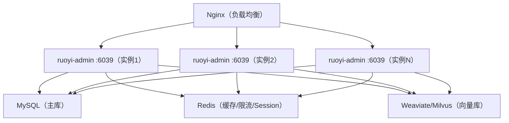

非功能测试项目组需要提供的信息

# 1、业务概述、业务变更内容、测试背景

**业务概述**：全栈式AI开发平台，提供Chat对话、知识库管理核心能力。用户可通过skill编排AI任务、上传文档构建知识库实现RAG问答、调用多种LLM模型进行对话。

**业务变更内容**：平台即将开放OpenAPI接口给外部系统调用，新增会话级文档上传与检索能力，SQL相关接口。


# 2、被测系统的应用部署交易路径图，需要标注出要测试的应用



**被测应用**：`ruoyi-admin`（双az多活部署）

# 3、被测系统每个应用的功能介绍和交易路径的介绍

| 应用/模块 | 功能 | 交易路径 |
|----------|------|----------|
| **ruoyi-admin** | 统一入口，用户认证（Sa-Token JWT），请求路由 | 所有请求经 Auth 认证后路由到各业务模块 |
| **ruoyi-chat** | Chat对话、知识库管理、RAG检索增强生成、MCP工具调用 | 上传文档→解析入库→对话时向量+关键词检索→RRF融合→LLM生成 |
| **ruoyi-system** | 用户管理、角色权限、菜单管理、租户管理、OSS管理 | 管理员CRUD维护基础数据 |

# 4、被测接口，每个接口对应的交易路径

| 接口 | 方法 | 路径 | 交易路径 |
|------|------|------|----------|
| 登录 | POST | `/auth/login` | 用户名密码→Sa-Token验证→返回JWT Token |
| 退出登录 | POST | `/auth/logout` | Token注销→Redis清理 |
| Chat对话（SSE） | POST | `/chat/send` | Token认证→知识库检索(RAG)→LLM流式生成→SSE返回 |
| 会话文档上传 | POST | `/chat/upload` | 文件上传→Loader解析（Word/Excel/PDF）→Splitter分块→Redis缓存 |
| 知识库列表 | GET | `/system/info/list` | 分页查询知识库列表 |
| 知识库新增 | POST | `/system/info` | 创建知识库，写入userId |
| 知识库修改 | PUT | `/system/info` | 更新知识库配置（模型/检索参数等） |
| 知识库删除 | DELETE | `/system/info/{ids}` | 级联删除知识库及关联附件、分块 |
| 附件上传 | POST | `/system/attach/upload` | 上传文件→OSS存储→待解析状态 |
| 附件解析 | POST | `/system/attach/parse/{id}` | Loader解析→Splitter分块→Embedding向量化→入库 |
| 附件列表 | GET | `/system/attach/list` | 分页查询知识库附件列表 |
| 附件删除 | DELETE | `/system/attach/{ids}` | 删除附件及关联分块、向量数据 |
| 知识分块列表 | GET | `/system/fragment/list` | 分页查询知识分块 |
| 知识分块检索测试 | POST | `/system/fragment/retrieval` | 测试检索效果，返回匹配分块及分数 |

# 5、要测试的接口名称、交易占比、日均生产交易总量、TPS

**说明：以下为预估数值，标记为。建议根据生产实际数据与系统经理确认后修正。**

| 接口 | 交易占比 | 日均交易量（预估） | 峰值TPS（预估） |
|------|----------|-------------------|----------------|
| `/auth/login` | 1% | 5,000 | 10 |
| `/auth/logout` | 1% | 3,000 | 5 |
| `/chat/send`（SSE） | 60% | 60,000 | 50  |
| `/chat/upload` | 10% | 10,000 | 20 |
| `/system/info/list` | 5% | 5,000 | 10 |
| `/system/info`（新增/修改） | 3% | 3,000 | 5 |
| `/system/attach/upload` | 8% | 8,000 | 15 |
| `/system/attach/parse/{id}` | 5% | 5,000 | 10 |
| `/system/attach/list` | 3% | 3,000 | 5 |
| `/system/fragment/list` | 2% | 2,000 | 5 |
| `/system/fragment/retrieval` | 1% | 1,000 | 3 |
| **合计** | **100%** | **100,000** | **50（峰值）** |

**特别注意**：`/chat/send`  为SSE长连接接口，单次连接持续10-60秒，压测时应关注**并发连接数**而非TPS。SSE接口每秒新建连接数（CPS, Connect Per Second）比TPS更具参考价值。

# 6、峰值时间段信息

| 时间段 | 说明 | 流量特征 |
|--------|------|----------|
| 24*7 | 无  | 无  |

 

# 7、预估未来两年生产交易量数据、TPS、增长率信息

| 年份 | 日均交易量 | 峰值TPS | 增长率 |
|------|-----------|---------|--------|
| 当前 | 100,00  | 50  | - |
| Year+1 | 2000  | 100  | 20% |
| Year+2 | 2000  | 100  | 20% |

**说明：** 以上为通用增速预估，需根据业务推广计划修正 。

# 8、涉及批处理需要给出批处理的场景名称、批处理步骤说明、批的数据量、触发点、触发方式、批的时间窗口等信息

| 项目 | 内容 |
|------|------|
| **批处理场景** | 会话临时文档过期清理 |
| **批处理步骤** | Redis Key `session:docs:*` 在写入时已设置30分钟TTL，由Redis自动过期删除 |
| **批数据量** | 无需批处理（Redis自动过期） |
| **触发点/方式** | Redis TTL（惰性删除 + 定期删除） |
| **批时间窗口** | 无固定时间窗口，Redis内部按需清理 |

**补充说明**：
- 项目已集成 SnailJob（`ruoyi-job` 模块）做定时任务调度
- 当前无业务批处理任务。如需后续增加（如日志归档、数据清理、统计报表），可在 SnailJob 管理后台配置
- 生产环境 SnailJob 默认关闭（`snail-job.enabled: false`），需按需开启

# 9、待测各接口的响应时间

**说明：** 以下为目标性能指标，需实际压测验证。

| 接口 | P50（ms） | P95（ms） | P99（ms） | 特殊说明 |
|------|-----------|-----------|-----------|----------|
| `/auth/login` | 200 | 500 | 1000 | 不含验证码校验 |
| `/auth/code` | 50 | 200 | 500 | 验证码图片生成 |
| `/chat/send`（纯对话） | 首Token 1000 | 首Token 3000 | 首Token 5000 | 不含RAG检索，仅LLM调用 |
| `/chat/send`（含RAG） | 首Token 3000 | 首Token 6000 | 首Token 10000 | 含Embedding+向量检索+重排序+LLM |
| `/chat/upload` | 500 | 1500 | 3000 | 含文件解析+文本分块+Redis写入 |
| `/system/info/list` | 100 | 300 | 500 | 分页查询 |
| `/system/info`（新增/修改） | 100 | 300 | 500 | 配置写入 |
| `/system/attach/upload` | 300 | 1000 | 2000 | 文件上传+OSS存储 |
| `/system/attach/parse/{id}` | 2000 | 5000 | 10000 | 含Loader解析+Splitter分块+Embedding向量化 |
| `/system/attach/list` | 100 | 300 | 500 | 分页查询 |
| `/system/fragment/list` | 100 | 300 | 500 | 分页查询 |
| `/system/fragment/retrieval` | 500 | 2000 | 5000 | 含向量检索+关键词检索+RRF融合 |

# 10、被测系统的各部署单元对应的部署平台、主机类型（容器/虚拟机/物理机）、操作系统&软件版本号、资源配置信息

| 部署单元 | 平台 | 主机类型 | 操作系统 | 软件版本 | 资源配置 |
|----------|------|----------|----------|----------|----------|
| ruoyi-admin | 待定 | 容器/虚拟机 | 麒麟服务器（ARM架构） | JDK 21, Spring Boot 3.5.8 | 4C8G起步 |
| MySQL | 待定   | 物理机/云数据库(TDSQL) | 麒麟服务器（ARM架构） | MySQL 8.0+ | 8C32G, SSD |
| Redis | 待定  | 容器/云Redis | 麒麟服务器（ARM架构） | Redis 6.x/7.x（Redisson 3.51） | 4C8G |
| Weaviate向量库 | 待定  | 容器（Docker） | 麒麟服务器（ARM架构） | Weaviate 1.19.6 | 4C16G |
| Nginx | 待定  | 容器/虚拟机 | 麒麟服务器（ARM架构） | Nginx 1.20+ | 2C4G |


# 11、被测系统的数据库表名、生产环境数据量、测试环境数据量

| 表名 | 说明 | 生产预估数据量 ⚠️ | 测试环境数据量 |
|------|------|-------------------|---------------|
| `chat_session` | 会话表 | 50万+ | 20,000 |
| `knowledge_info` | 知识库信息表 | 1万+ | 100 |
| `knowledge_attach` | 知识附件表 | 10万+ | 1,000 |
| `knowledge_fragment` | 知识分块表 | 10万+ | 10,000 |
| `chat_message` | 对话消息表 | 100万+ | 50,000 |

**说明**：
- `knowledge_fragment` 包含 MySQL FULLTEXT 索引，写操作性能需关注
- `chat_message`   为高写入表，需关注归档策略

# 12、被测接口每个接口对应的参数化字段和参数化数据量

| 接口 | 参数化字段 | 参数来源 | 参数化数据量 |
|------|-----------|----------|-------------|
| `/auth/login` | `username`, `password` | 用户表 | 1,000个测试用户 |
| `/auth/login` | `tenantId` | 租户表 | 5个测试租户 | 
| `/chat/send` | `content` | 测试问题语料库 | 500条问题（含长/短文本） |
| `/chat/send` | `knowledgeId` | 知识库表 | 100个知识库ID |
| `/chat/send` | `sessionId` | 动态生成 | 每轮压测动态创建 |
| `/chat/send` | `enableThinking` | 布尔值 | true/false |
| `/chat/upload` | `file`（MultipartFile） | 测试文件库 | 50个文件（Word 15个/PDF 15个/Excel 15个/TXT 5个，各含大小文件） |

| `/system/attach/upload` | `file`（MultipartFile）, `knowledgeId` | 测试文件库+知识库ID | 50个文件 × 10个知识库 |
| `/system/attach/parse/{id}` | `id`（路径参数） | 附件表 | 50个待解析附件ID |
| `/system/attach/list` | `knowledgeId`, `status`, `currentPage`, `pageSize` | 知识库ID+状态枚举 | 20个知识库ID，5组分页参数 |
| `/system/fragment/list` | `knowledgeId`, `docId`, `currentPage`, `pageSize` | 知识库ID+文档ID | 20个知识库ID，5组分页参数 |
| `/system/fragment/retrieval` | `kid`, `query`, `enableHybrid`, `maxResults` | 检索参数模板 | 50组检索参数（不同query+配置组合） |

# 13、被测接口的接口配置信息

### 13.1 认证接口

#### (1) 用户登录

- **接口说明**：用户登录认证，验证用户名、密码、验证码及租户信息，成功返回JWT Token
- **请求方式**：`POST`
- **请求路径**：`/auth/login`
- **Content-Type**：`application/json`
- **请求参数（Request Body）**：

| 参数名 | 类型 | 必填 | 说明 |
|--------|------|------|------|
| `username` | string | 是 | 用户名 |
| `password` | string | 是 | 密码 |
| `tenantId` | string | 是 | 租户ID |
| `code` | string | 是 | 验证码 |
| `uuid` | string | 是 | 验证码UUID |

- **请求示例**：
```json
{
  "username": "admin",
  "password": "123456",
  "tenantId": "T001",
  "code": "abcd",
  "uuid": "550e8400-e29b-41d4-a716-446655440000"
}
```

- **响应格式**：`application/json`

| 状态码 | 说明 |
|--------|------|
| 200 | 操作成功 |
| 400 | 参数校验失败 |
| 401 | 认证失败（用户名/密码错误、验证码错误等） |

- **成功响应示例**：
```json
{
  "code": 200,
  "msg": "操作成功",
  "data": {
    "token": "eyJhbGciOiJIUzI1NiJ9.eyJzdWIiOiJhZG1pbiJ9.xxx"
  }
}
```

---

#### (2) 退出登录

- **接口说明**：注销当前登录用户，使JWT Token失效
- **请求方式**：`POST`
- **请求路径**：`/auth/logout`
- **请求头**：

| 参数名 | 必填 | 说明 |
|--------|------|------|
| `Authorization` | 是 | Bearer Token，值为登录接口返回的token |

- **响应格式**：`application/json`

| 状态码 | 说明 |
|--------|------|
| 200 | 退出成功 |
| 401 | Token无效或已过期 |

- **成功响应示例**：
```json
{
  "code": 200,
  "msg": "退出成功"
}
```

---

### 13.2 对话接口

#### (3) Chat对话（SSE流式）

- **接口说明**：发起AI对话请求，支持RAG知识库检索增强生成，以SSE（Server-Sent Events）流式返回回复内容。可选择启用深度思考模式
- **请求方式**：`POST`
- **请求路径**：`/chat/send`
- **Content-Type**：`application/json`
- **请求头**：

| 参数名 | 必填 | 说明 |
|--------|------|------|
| `Authorization` | 是 | Bearer Token |

- **请求参数（Request Body）**：

| 参数名 | 类型 | 必填 | 说明 |
|--------|------|------|------|
| `content` | string | 是 | 用户提问内容 |
| `knowledgeId` | string | 否 | 知识库ID，传入时启用RAG检索 |
| `sessionId` | string | 是 | 会话ID |
| `enableThinking` | boolean | 否 | 是否启用深度思考（默认false） |

- **请求示例**：
```json
{
  "content": "什么是全栈式AI开发平台？",
  "knowledgeId": "kb_001",
  "sessionId": "sess_20250101_001",
  "enableThinking": true
}
```

- **响应格式**：`text/event-stream`（SSE流式响应）

| 状态码 | 说明 |
|--------|------|
| 200 | SSE流式连接建立成功 |
| 400 | 参数校验失败 |
| 401 | Token无效或已过期 |

- **SSE事件类型**：

| event: type | 说明 |
|-------------|------|
| `thinking` | 深度思考过程文本 |
| `content` | AI回复内容文本 |
| `error` | 异常错误信息 |
| `done` | 传输结束标记 |

- **SSE响应示例**：
```
data: {"type": "thinking", "data": "正在分析用户问题..."}

data: {"type": "content", "data": "全栈式AI开发平台是一种..."}

data: {"type": "done", "data": "complete"}
```

---

### 13.3 文件上传接口

#### (4) 会话文档上传

- **接口说明**：上传文档文件至指定会话，系统将解析文件内容（Word/Excel/PDF/TXT）并分块存入Redis缓存，供后续RAG检索使用
- **请求方式**：`POST`
- **请求路径**：`/chat/upload`
- **Content-Type**：`multipart/form-data`
- **请求头**：

| 参数名 | 必填 | 说明 |
|--------|------|------|
| `Authorization` | 是 | Bearer Token |

- **请求参数**：

| 参数名 | 类型 | 必填 | 参数位置 | 说明 |
|--------|------|------|----------|------|
| `file` | file | 是 | FormData | 上传的文件（支持Word/Excel/PDF/TXT） |
| `sessionId` | string | 是 | Query/Form | 会话ID |

- **请求示例（cURL）**：
```bash
curl -X POST "/chat/upload?sessionId=sess_001" \
  -H "Authorization: Bearer <token>" \
  -F "file=@document.pdf"
```

- **响应格式**：`application/json`

| 状态码 | 说明 |
|--------|------|
| 200 | 上传并解析成功 |
| 400 | 文件格式不支持或参数缺失 |
| 401 | Token无效或已过期 |
| 413 | 文件大小超出限制 |

- **成功响应示例**：
```json
{
  "code": 200,
  "msg": "上传成功",
  "data": {
    "fileName": "document.pdf",
    "fileSize": 102400
  }
}
```

---

### 13.4 知识库管理接口

#### (5) 知识库附件上传

- **接口说明**：上传文件到指定知识库，支持Word/Excel/PDF/TXT等格式。文件上传至OSS后，附件状态标记为"待解析"
- **请求方式**：`POST`
- **请求路径**：`/system/attach/upload`
- **Content-Type**：`multipart/form-data`
- **请求头**：

| 参数名 | 必填 | 说明 |
|--------|------|------|
| `Authorization` | 是 | Bearer Token |

- **请求参数**：

| 参数名 | 类型 | 必填 | 参数位置 | 说明 |
|--------|------|------|----------|------|
| `file` | file | 是 | FormData | 上传的文件 |
| `knowledgeId` | Long | 是 | FormData | 目标知识库ID |
| `autoParse` | Boolean | 否 | FormData | 是否立即解析（默认true） |

- **请求示例（cURL）**：
```bash
curl -X POST "/system/attach/upload" \
  -H "Authorization: Bearer <token>" \
  -F "file=@document.docx" \
  -F "knowledgeId=1001" \
  -F "autoParse=true"
```

- **响应格式**：`application/json`

| 状态码 | 说明 |
|--------|------|
| 200 | 上传成功 |
| 400 | 文件格式不支持或参数缺失 |
| 401 | Token无效或已过期 |
| 413 | 文件大小超出限制 |

- **成功响应示例**：
```json
{
  "code": 200,
  "msg": "上传成功!"
}
```

---

#### (6) 附件内容解析

- **接口说明**：对已上传的附件执行内容解析：Loader提取文本→Splitter分块→Embedding向量化→写入向量库和MySQL
- **请求方式**：`POST`
- **请求路径**：`/system/attach/parse/{id}`
- **请求头**：

| 参数名 | 必填 | 说明 |
|--------|------|------|
| `Authorization` | 是 | Bearer Token |

- **请求参数**：

| 参数名 | 类型 | 必填 | 参数位置 | 说明 |
|--------|------|------|----------|------|
| `id` | Long | 是 | Path | 附件ID |

- **请求示例**：
```bash
curl -X POST "/system/attach/parse/5001" \
  -H "Authorization: Bearer <token>"
```

- **响应格式**：`application/json`

| 状态码 | 说明 |
|--------|------|
| 200 | 解析成功 |
| 400 | 附件不存在或已删除 |
| 401 | Token无效或已过期 |
| 500 | 解析过程异常（文件损坏/Embedding失败等） |

- **成功响应示例**：
```json
{
  "code": 200,
  "msg": "操作成功"
}
```

**注意**：解析为异步操作，状态变化：`0待解析` → `1解析中` → `2已解析`（或`3解析失败`），通过附件列表接口查询状态。

---

#### (7) 附件列表查询

- **接口说明**：分页查询知识库下的附件列表，可按状态筛选
- **请求方式**：`GET`
- **请求路径**：`/system/attach/list`
- **请求头**：

| 参数名 | 必填 | 说明 |
|--------|------|------|
| `Authorization` | 是 | Bearer Token |

- **请求参数（Query String）**：

| 参数名 | 类型 | 必填 | 说明 |
|--------|------|------|------|
| `knowledgeId` | Long | 否 | 知识库ID（为空则查全部） |
| `status` | Integer | 否 | 解析状态：0待解析/1解析中/2已解析/3解析失败 |
| `name` | String | 否 | 附件名称（模糊匹配） |
| `currentPage` | Integer | 是 | 当前页码 |
| `pageSize` | Integer | 是 | 每页条数 |

- **请求示例**：
```bash
curl -X GET "/system/attach/list?knowledgeId=1001&status=2&currentPage=1&pageSize=10" \
  -H "Authorization: Bearer <token>"
```

- **响应格式**：`application/json`

| 状态码 | 说明 |
|--------|------|
| 200 | 查询成功 |
| 401 | Token无效或已过期 |

- **成功响应示例**：
```json
{
  "code": 200,
  "msg": "查询成功",
  "data": {
    "total": 50,
    "rows": [
      {
        "id": 5001,
        "knowledgeId": 1001,
        "docId": "doc_a1b2c3",
        "name": "产品需求文档.docx",
        "type": "docx",
        "status": 2,
        "createTime": "2025-01-15 10:30:00"
      }
    ]
  }
}
```

| 响应字段 | 类型 | 说明 |
|----------|------|------|
| `total` | Long | 总条数 |
| `rows[].id` | Long | 附件ID |
| `rows[].knowledgeId` | Long | 所属知识库ID |
| `rows[].docId` | String | 文档唯一标识 |
| `rows[].name` | String | 附件名称 |
| `rows[].type` | String | 附件类型（docx/pdf/xlsx/txt等） |
| `rows[].status` | Integer | 0待解析/1解析中/2已解析/3解析失败 |
| `rows[].createTime` | String | 上传时间 |

---

#### (8) 知识分块列表查询

- **接口说明**：分页查询知识库下的文本分块列表，可关联文档ID筛选
- **请求方式**：`GET`
- **请求路径**：`/system/fragment/list`
- **请求头**：

| 参数名 | 必填 | 说明 |
|--------|------|------|
| `Authorization` | 是 | Bearer Token |

- **请求参数（Query String）**：

| 参数名 | 类型 | 必填 | 说明 |
|--------|------|------|------|
| `knowledgeId` | Long | 否 | 知识库ID |
| `docId` | String | 否 | 文档ID |
| `content` | String | 否 | 内容关键词 |
| `currentPage` | Integer | 是 | 当前页码 |
| `pageSize` | Integer | 是 | 每页条数 |

- **请求示例**：
```bash
curl -X GET "/system/fragment/list?knowledgeId=1001&docId=doc_a1b2c3&currentPage=1&pageSize=10" \
  -H "Authorization: Bearer <token>"
```

- **响应格式**：`application/json`

| 状态码 | 说明 |
|--------|------|
| 200 | 查询成功 |
| 401 | Token无效或已过期 |

- **成功响应示例**：
```json
{
  "code": 200,
  "msg": "查询成功",
  "data": {
    "total": 500,
    "rows": [
      {
        "id": 10001,
        "docId": "doc_a1b2c3",
        "knowledgeId": 1001,
        "idx": 0,
        "content": "产品需求文档\\n## 1. 用户登录功能...",
        "createTime": "2025-01-15 10:30:00"
      }
    ]
  }
}
```

| 响应字段 | 类型 | 说明 |
|----------|------|------|
| `total` | Long | 总条数 |
| `rows[].id` | Long | 分块ID |
| `rows[].docId` | String | 所属文档ID |
| `rows[].knowledgeId` | Long | 所属知识库ID |
| `rows[].idx` | Integer | 分块序号（从0开始） |
| `rows[].content` | String | 分块文本内容 |
| `rows[].createTime` | String | 创建时间 |

---

#### (9) 检索测试

- **接口说明**：测试知识库检索效果，返回匹配的分块列表及相似度得分。用于调优检索参数（混合检索开关、重排序配置等）
- **请求方式**：`POST`
- **请求路径**：`/system/fragment/retrieval`
- **Content-Type**：`application/json`
- **请求头**：

| 参数名 | 必填 | 说明 |
|--------|------|------|
| `Authorization` | 是 | Bearer Token |

- **请求参数（Request Body）**：

| 参数名 | 类型 | 必填 | 说明 |
|--------|------|------|------|
| `knowledgeId` | Long | 是 | 知识库ID |
| `query` | String | 是 | 检索查询文本 |
| `topK` | Integer | 否 | 返回条数（默认10） |
| `threshold` | Double | 否 | 相似度阈值（0-1） |
| `enableHybrid` | Boolean | 否 | 是否启用混合检索（向量+关键词） |
| `enableRerank` | Boolean | 否 | 是否启用重排序 |
| `rerankModel` | String | 否 | 重排序模型名称 |

- **请求示例**：
```json
{
  "knowledgeId": 1001,
  "query": "用户登录功能有哪些要求",
  "topK": 5,
  "threshold": 0.7,
  "enableHybrid": true,
  "enableRerank": true
}
```

- **响应格式**：`application/json`

| 状态码 | 说明 |
|--------|------|
| 200 | 检索成功 |
| 400 | 参数校验失败 |
| 401 | Token无效或已过期 |
| 500 | 检索异常（Embedding失败/向量库不可用等） |

- **成功响应示例**：
```json
{
  "code": 200,
  "msg": "操作成功",
  "data": [
    {
      "id": "10001",
      "docId": "doc_a1b2c3",
      "knowledgeId": 1001,
      "idx": 3,
      "content": "## 1. 用户登录功能\\n\\n| 字段 | 类型 | 必填 |\\n|------|------|------|\\n| 账号 | String | 是 |\\n| 密码 | String | 是 |",
      "score": 0.92
    },
    {
      "id": "10005",
      "docId": "doc_a1b2c3",
      "knowledgeId": 1001,
      "idx": 7,
      "content": "## 2. 密码复杂度要求\\n\\n密码长度不少于8位，必须包含大小写字母和数字",
      "score": 0.85
    }
  ]
}
```

| 响应字段 | 类型 | 说明 |
|----------|------|------|
| `data[].id` | String | 分块ID |
| `data[].docId` | String | 所属文档ID |
| `data[].knowledgeId` | Long | 所属知识库ID |
| `data[].idx` | Integer | 分块序号 |
| `data[].content` | String | 分块文本内容 |
| `data[].score` | Double | 相似度得分（0-1，越高越相关） |

---

# 14、其他特殊说明

## 14.1 SSE长连接特性
- `/chat/send` 和 `/workflow/run` 为SSE流式接口，单连接持续10-60秒
- 压测时应关注**并发连接数（Concurrent Connections）**而非短期TPS
- Undertow Worker线程池默认256，若500+并发SSE连接可能需要调大
- SSE连接在 `SseEmitterManager` 中维护，连接超时需要验证资源释放

## 14.2 Redis依赖
- 限流（Redisson `RRateLimiter`）、Token存储、会话文档缓存（`session:docs:*`）均依赖Redis
- Redis不可用时影响范围：登录不可用、限流失效、会话文档无法检索
- 压测时应包含Redis故障场景的降级验证

## 14.3 向量库依赖
- RAG检索依赖Weaviate/Milvus/Qdrant向量数据库
- 向量库不可用时需验证降级行为：MySQL Fulltext关键词检索能否替代
- `KnowledgeRetrievalServiceImpl.performCoarseRetrieval()` 中向量检索异常时会回退到关键词检索

## 14.4 LLM API外部依赖
- Chat和工作流执行依赖外部LLM API（OpenAI/通义千问/DeepSeek等）
- LLM API的延迟和并发限制是核心瓶颈之一，属于外部依赖风险
- 压测时建议对LLM API做Mock：使用固定延迟+固定响应，排除外部依赖波动影响
- 需确认LLM API提供方的并发限制和Rate Limit策略

## 14.5 MySQL Fulltext索引
- `knowledge_fragment.content` 列包含 MySQL FULLTEXT 索引
- 关键词检索走 `MATCH(content) AGAINST(#{query} IN NATURAL LANGUAGE MODE)`
- 高并发下FULLTEXT查询可能成为瓶颈，压测时应关注该SQL的执行计划和响应时间
- 建议关注知识库查询接口的P99延迟

## 14.6 知识库检索链路
- RAG完整链路：Embedding向量化 → 向量检索 + 关键词检索 → RRF融合 → Rerank重排序 → 注入LLM上下文
- 该链路为 `/chat/send` 接口内部调用，不对外暴露独立接口
- 链路中向量检索（Weaviate/Milvus）和重排序（Cross-encoder模型API）为外部RPC调用，需关注超时和重试策略

## 14.7 会话文档临时存储
- 会话上传的文档解析后存储在Redis `session:docs:{sessionId}` Key中
- TTL为30分钟，每次上传新文档会覆盖旧文档（先删后写）
- 压测时需观察Redis内存使用曲线：大量并发会话 × 文档分块可能占用较多内存

## 14.8 需要与系统经理确认的事项 
- 第5项：日均交易量、TPS，需根据生产实际数据修正
- 第6项：峰值时间段，需根据用户画像确认
- 第7项：未来两年增长率，需根据业务推广计划确认
- 第10项：部署平台及资源配置，需根据运维规划确认
- 第11项：生产环境数据量，需根据实际数据库统计
- 第14.4项：LLM API提供方的并发限制和Rate Limit策略
